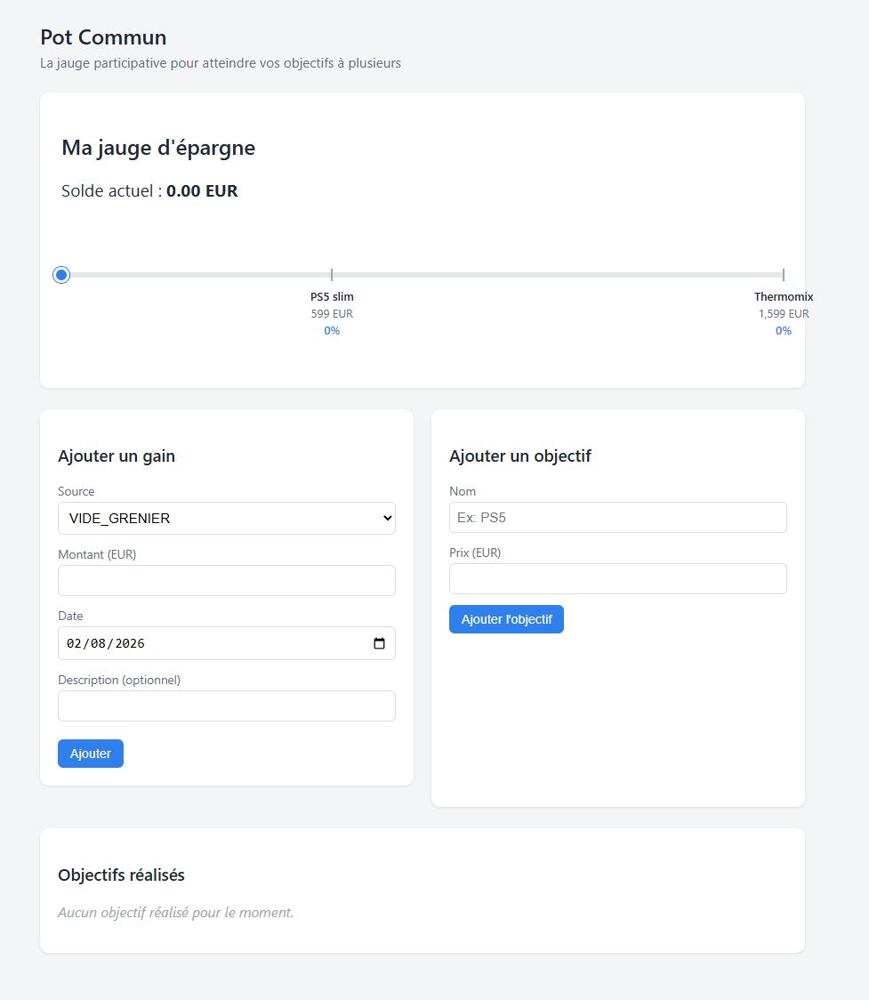
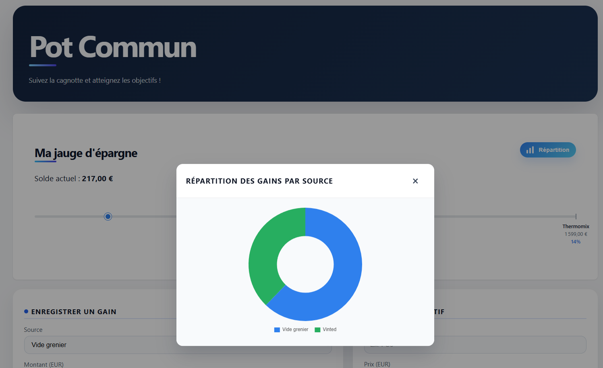

# Pot Commun

Application de suivi d'epargne qui permet d'enregistrer des petits gains (vide-grenier, Vinted, cadeaux ...) et de voir sur une jauge unique à quel point on est proche (ou pas) de nos objectifs (PS5, Thermomix...).  
Récupérer un objectif déduit son prix du solde total évidemment (attention, le solde peut devenir négatif si vous n'arrivez pas à attendre d'atteindre un palier ! Hihi).

## Architecture

```
potcommun/
├── backend/     Spring Boot (Java 25) + H2 en mode fichier
└── frontend/    Angular 21 (standalone components)
```

## Lancer le backend

Prérequis : Java 25, Spring Boot 4.1.0 et Maven.

```bash
cd backend
mvn spring-boot:run
```

L'API démarre sur `http://localhost:8080`.  
La base H2 est stockée dans `backend/data/potcommun.mv.db`, ce choix pour que la base persiste entre les redémarrages.  
Console H2 disponible sur `http://localhost:8080/h2-console` (JDBC URL : `jdbc:h2:file:./data/potcommun`, user `sa`, pas de mot de passe par défaut => configuration dans application.properties).

### Endpoints principaux

- `GET /api/gains` / `POST /api/gains` / `DELETE /api/gains/{id}`
- `GET /api/objectifs` (en option : `?statut=DISPONIBLE` ou `?statut=RECUPERE`)
- `POST /api/objectifs`
- `POST /api/objectifs/{id}/recuperer` : permet de récupérer un objectif et donc de le déduire du solde
- `GET /api/solde` : solde courant = somme des gains - somme des objectifs récupérés

## Lancer le frontend

Prerequis : Node.js 21 et npm.

```bash
cd frontend
npm install
npm start
```

L'application est disponible sur `http://localhost:4200` et appelle le backend sur `http://localhost:8080`.




